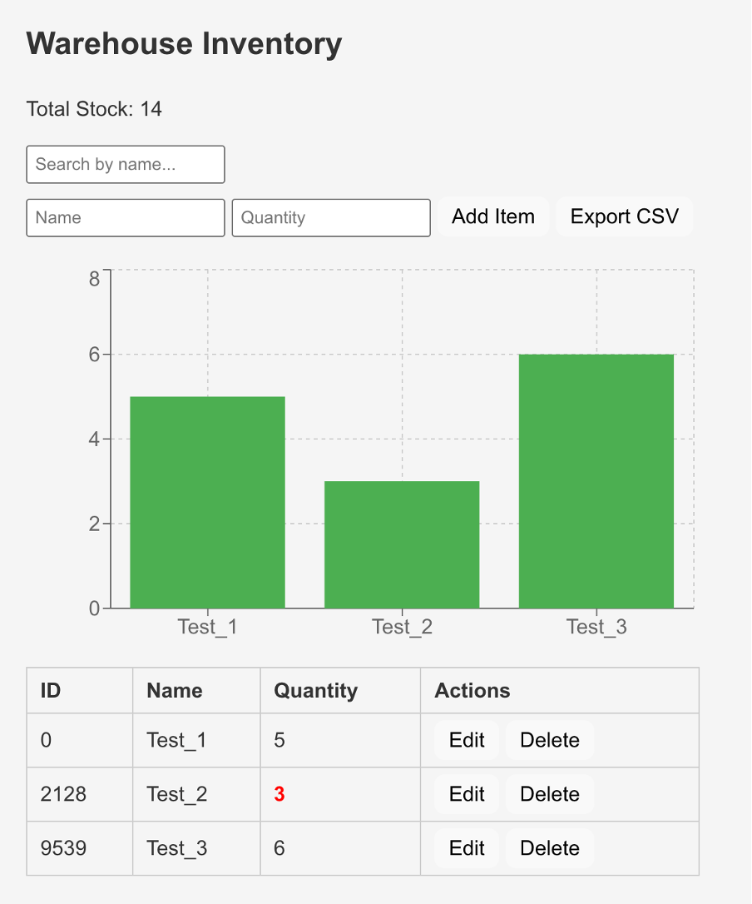

````markdown
# Warehouse Inventory Management

A simple **Inventory Management System** to track and manage warehouse items. Built with **Python (FastAPI/Flask)** for the backend and **HTML/JS/CSS** for the frontend.  

## Features

- **View Inventory** – See a list of all items with quantities.  
- **Add Items** – Add new inventory items.  
- **Edit/Delete Items** – Update or remove existing items.  
- **Search Items** – Search inventory by name.  
- **Export CSV** – Download inventory as a CSV file.  
- **Total Stock Display** – See the total quantity of all items.  

## Technologies Used

- **Backend:** Python, FastAPI/Flask  
- **Frontend:** HTML, CSS, JavaScript  
- **Database:** SQLite  

## Setup Instructions

### Backend
```bash
cd backend
pip install -r requirements.txt
uvicorn main:app --reload
````

### Frontend

```bash
cd frontend
npm install
npm run dev
```

### Accessing the App

* Open the frontend in your browser (usually `http://localhost:3000`).
* Start managing your warehouse inventory!

## Notes

* This version focuses **only on inventory management**.
* Orders, shipments, and alerts are not included in this version.

## Screenshot



